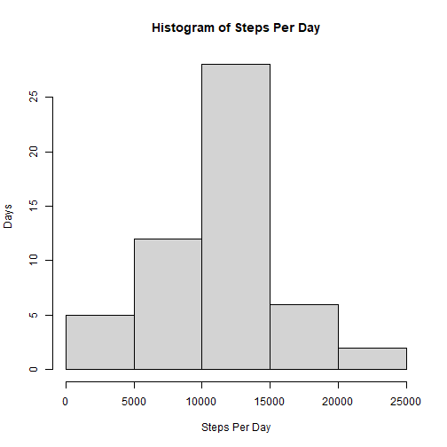
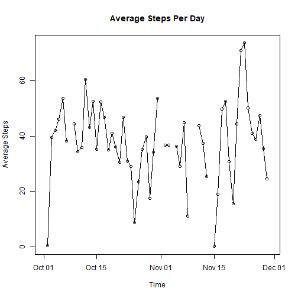
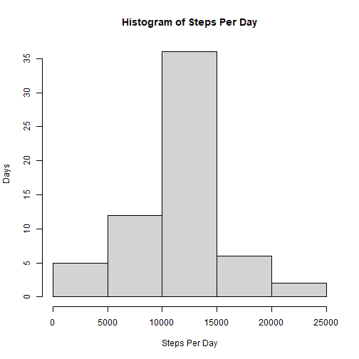
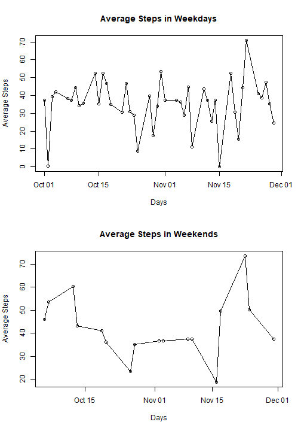

---
output:
  html_document: default
  pdf_document: default
---
Courser Reproducible Research Week 2 Project
============================================

First, let's read the data. And then let's look at the first 20 observations


```r
dataset <- read.csv('activity.csv')
head(dataset,20)
```

```
##    steps       date interval
## 1     NA 2012-10-01        0
## 2     NA 2012-10-01        5
## 3     NA 2012-10-01       10
## 4     NA 2012-10-01       15
## 5     NA 2012-10-01       20
## 6     NA 2012-10-01       25
## 7     NA 2012-10-01       30
## 8     NA 2012-10-01       35
## 9     NA 2012-10-01       40
## 10    NA 2012-10-01       45
## 11    NA 2012-10-01       50
## 12    NA 2012-10-01       55
## 13    NA 2012-10-01      100
## 14    NA 2012-10-01      105
## 15    NA 2012-10-01      110
## 16    NA 2012-10-01      115
## 17    NA 2012-10-01      120
## 18    NA 2012-10-01      125
## 19    NA 2012-10-01      130
## 20    NA 2012-10-01      135
```

Ok, how much data we have?


```r
dim(dataset)
```

```
## [1] 17568     3
```

Fine, how does the data look like


```r
summary(dataset)
```

```
##      steps            date              interval     
##  Min.   :  0.00   Length:17568       Min.   :   0.0  
##  1st Qu.:  0.00   Class :character   1st Qu.: 588.8  
##  Median :  0.00   Mode  :character   Median :1177.5  
##  Mean   : 37.38                      Mean   :1177.5  
##  3rd Qu.: 12.00                      3rd Qu.:1766.2  
##  Max.   :806.00                      Max.   :2355.0  
##  NA's   :2304
```

```r
str(dataset)
```

```
## 'data.frame':	17568 obs. of  3 variables:
##  $ steps   : int  NA NA NA NA NA NA NA NA NA NA ...
##  $ date    : chr  "2012-10-01" "2012-10-01" "2012-10-01" "2012-10-01" ...
##  $ interval: int  0 5 10 15 20 25 30 35 40 45 ...
```

Great, let's explore it then!

Let's see a histogram of daily steps. We will need to:
- Aggregate the 'steps' column to the 'date' column so we have total steps per day
- Afterwards, we will plot a histogram with BaseR


```r
dataset_by_day <- aggregate(dataset$steps, by=list(dataset$date), sum)
hist(dataset_by_day$x, 
        xlab = 'Steps Per Day', 
        main = 'Histogram of Steps Per Day', 
        ylab = 'Days')
```



Cool, now let's compute the mean and median of steps taken per day


```r
mean(dataset_by_day$x, na.rm = T)
```

```
## [1] 10766.19
```

```r
median(dataset_by_day$x, na.rm = T)
```

```
## [1] 10765
```

Now, we would like to see a time-series of the average steps taken per day.
First we create another dataset with average number of steps per day, then plot!


```r
dataset_avg_by_day <- aggregate(dataset$steps, by=list(dataset$date), mean)
dataset_avg_by_day$Group.1 <- as.Date(dataset_avg_by_day$Group.1)
plot(dataset_avg_by_day, 
     xlab='Time', 
     ylab='Average Steps', 
     main='Average Steps Per Day')
lines(dataset_avg_by_day)
```



Let's find the 5-minute interval that has the maximum number of steps


```r
#we first find the maximum number of steps and store it in max_steps
max_steps <- max(dataset$steps, na.rm = T)
#then use this value to find the interval
max_interval <- dataset$interval[dataset$steps==max_steps]
sum(max_interval, na.rm = T)
```

```
## [1] 615
```

There are lots of missing value. It is a good idea to replace missing values by the mean


```r
dataset_imputed <- dataset
dataset_imputed$steps[is.na(dataset_imputed$steps)] <- mean(dataset$steps, na.rm = T)
summary(dataset_imputed)
```

```
##      steps            date              interval     
##  Min.   :  0.00   Length:17568       Min.   :   0.0  
##  1st Qu.:  0.00   Class :character   1st Qu.: 588.8  
##  Median :  0.00   Mode  :character   Median :1177.5  
##  Mean   : 37.38                      Mean   :1177.5  
##  3rd Qu.: 37.38                      3rd Qu.:1766.2  
##  Max.   :806.00                      Max.   :2355.0
```

Now, let's re-visit the histogram

```r
dataset_imputed_by_day <- aggregate(dataset_imputed$steps, by=list(dataset_imputed$date), sum)
hist(dataset_imputed_by_day$x, 
        xlab = 'Steps Per Day', 
        main = 'Histogram of Steps Per Day', 
        ylab = 'Days')
```



Let's make a time-series for the steps once for weekdays and once for weekends


```r
dataset_with_day_names <- dataset_imputed
dataset_with_day_names$dayname <- weekdays(as.Date(dataset_with_day_names$date))
dataset_weekends <- dataset_with_day_names[dataset_with_day_names$dayname == 'Friday' | 
                                             dataset_with_day_names$dayname == 'Saturday',]
dataset_weekdays <- dataset_with_day_names[dataset_with_day_names$dayname == 'Sunday'| 
                                           dataset_with_day_names$dayname == 'Monday' |
                                             dataset_with_day_names$dayname == 'Tuesday'|
                                             dataset_with_day_names$dayname == 'Wednesday'|
                                             dataset_with_day_names$dayname == 'Thursday', ]
dim(dataset_weekdays)
```

```
## [1] 12672     4
```

```r
dim(dataset_weekends)
```

```
## [1] 4896    4
```

```r
head(dataset_weekdays)
```

```
##     steps       date interval dayname
## 1 37.3826 2012-10-01        0  Monday
## 2 37.3826 2012-10-01        5  Monday
## 3 37.3826 2012-10-01       10  Monday
## 4 37.3826 2012-10-01       15  Monday
## 5 37.3826 2012-10-01       20  Monday
## 6 37.3826 2012-10-01       25  Monday
```

```r
head(dataset_weekends)
```

```
##      steps       date interval dayname
## 1153     0 2012-10-05        0  Friday
## 1154     0 2012-10-05        5  Friday
## 1155     0 2012-10-05       10  Friday
## 1156     0 2012-10-05       15  Friday
## 1157     0 2012-10-05       20  Friday
## 1158     0 2012-10-05       25  Friday
```

```r
dataset_weekdays_avg <- aggregate(dataset_weekdays$steps, by=list(dataset_weekdays$date), mean)
dataset_weekends_avg <- aggregate(dataset_weekends$step, by=list(dataset_weekends$date), mean)
head(dataset_weekdays_avg)
```

```
##      Group.1        x
## 1 2012-10-01 37.38260
## 2 2012-10-02  0.43750
## 3 2012-10-03 39.41667
## 4 2012-10-04 42.06944
## 5 2012-10-07 38.24653
## 6 2012-10-08 37.38260
```

```r
head(dataset_weekends_avg)
```

```
##      Group.1        x
## 1 2012-10-05 46.15972
## 2 2012-10-06 53.54167
## 3 2012-10-12 60.35417
## 4 2012-10-13 43.14583
## 5 2012-10-19 41.07292
## 6 2012-10-20 36.09375
```

```r
dataset_weekdays_avg$Group.1 <- as.Date(dataset_weekdays_avg$Group.1)
dataset_weekends_avg$Group.1 <- as.Date(dataset_weekends_avg$Group.1)
```

That was lots of preparing!
Now the plot


```r
par(mfrow=c(2,1))
plot(dataset_weekdays_avg, xlab = 'Days', ylab = 'Average Steps',
     main = 'Average Steps in Weekdays')
lines(dataset_weekdays_avg)
plot(dataset_weekends_avg, xlab = 'Days', ylab = 'Average Steps',
     main = 'Average Steps in Weekends')
lines(dataset_weekends_avg)
```


